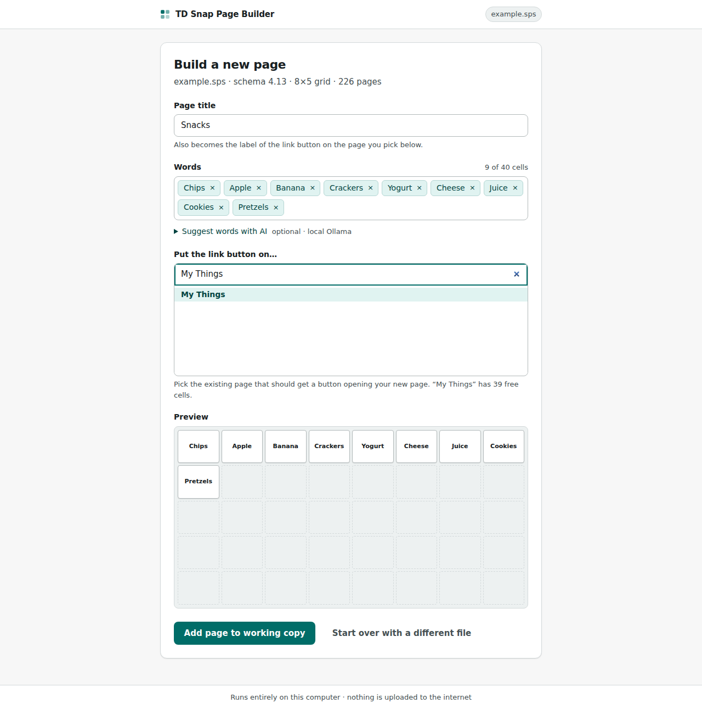

# TD Snap Page Builder

[](https://github.com/rjpenny16/AAC-Editor/actions/workflows/tests.yml)
[](https://github.com/rjpenny16/AAC-Editor/releases/latest)
[](LICENSE)

TD Snap Page Builder helps AAC users, parents, SLPs, and other professionals
spend less time editing buttons and more time communicating. Add many words or
entire topic pages at once, review every change before it runs, and update the
page set already open in TD Snap so it keeps its existing sharing and sync
identity—saving hours of repetitive work.



## Download

Download **`TDSnapPageBuilder-*-windows-x64.zip`** from the
[latest release](https://github.com/rjpenny16/AAC-Editor/releases/latest), unzip
it, and open **TD Snap Page Builder.exe**. Python is not required.

> Windows may warn about an unfamiliar unsigned app. Releases are built by the
> public GitHub Actions workflow and include a SHA-256 checksum and verifiable
> build attestation.

## What it does

- Adds words to exact empty cells on an existing TD Snap page.
- Creates word or color-coded topic pages and links them from an existing page.
- Keeps established vocabulary locked, rejects duplicates, and checks capacity.
- Adds matching TD Snap symbols when TD Snap can find them.
- Suggests AAC-friendly placement and optional words or phrases with local AI.
- Verifies the completed edit and reports anything that still needs review.

The guided setup can keep explanations visible for a new user or switch to a
compact workspace for someone already familiar with the editor.

## Private by design

The app listens only on your computer. Direct mode edits TD Snap through its
own Windows controls, so the active page set keeps its existing sharing and
sync identity. Page-set content is not uploaded by this project.

AI is optional and local:

- The packaged app can download Qwen2.5 1.5B Instruct once (~1 GB, Apache-2.0)
  and run it offline.
- If [Ollama](https://ollama.com/download) is already running, the app can use
  one of its installed models instead.

## Quick start

1. Open TD Snap and the page set you want to edit.
2. Open TD Snap Page Builder and select **Connect to TD Snap**.
3. Choose **Add to an existing page** or **Create a new page**.
4. Add and arrange buttons in the preview, then select **Update TD Snap**.
5. Review the checks before returning to TD Snap.

Keep Windows unlocked while an edit runs. The live editor is Windows-only and
depends on the current TD Snap interface. The exported-file fallback is
validated against a genuine TD Snap 4.13 export; see
[Importing edited page sets safely](docs/IMPORT_SAFETY.md) before using it.

## Python and command-line use

Requires Python 3.9 or newer:

```bash
pip install .
python -m tdsnap.web
```

Add `.[ai]` to install the built-in AI engine. The launchers are also available:

- Windows: double-click `launch.bat`
- macOS/Linux: run `./launch.sh` for exported-file and command-line work

Common commands:

```bash
python -m tdsnap list "My Page Set.sps"
python -m tdsnap verify "My Page Set.edited.sps"
python -m tdsnap inspect "My Page Set.sps"
python -m tdsnap.live status
python -m tdsnap.live add --yes --title Snacks --item Chips --item Apple
```

Exported-file edits always write a separate `*.edited.sps` copy. They discover
the file's schema at runtime, clone TD Snap's own records as templates, and run
SQLite integrity, foreign-key, linkage, and unexpected-change checks before
saving. TD Snap's proprietary `SyncHash` cannot be reproduced, so direct mode
is preferred when page-set sync matters.

## Development

```bash
pip install -r requirements.txt pytest
python -m pytest
npm ci
npx playwright install chromium
npm run test:e2e
```

The browser suite mocks TD Snap accessibility responses and cannot edit a real
page set unless `TDSNAP_LIVE_E2E=1` is explicitly set. A real proprietary page
set must never be committed; `scripts/fetch_fixture.py` downloads the optional
integration fixture when needed.

Bug reports and pull requests are welcome. Read [CONTRIBUTING.md](CONTRIBUTING.md)
and the [security policy](SECURITY.md) first.

## License and trademarks

[MIT](LICENSE). The optional AI model is downloaded separately under its own
Apache-2.0 license. “TD Snap” is a trademark of Tobii Dynavox. This independent
community project is not affiliated with or endorsed by Tobii Dynavox.

---

Built by **Ryan Penny, M.A., CCC-SLP**, owner of
[myVoice Speech Therapy](https://www.myvoicespeechtherapy.com/).
