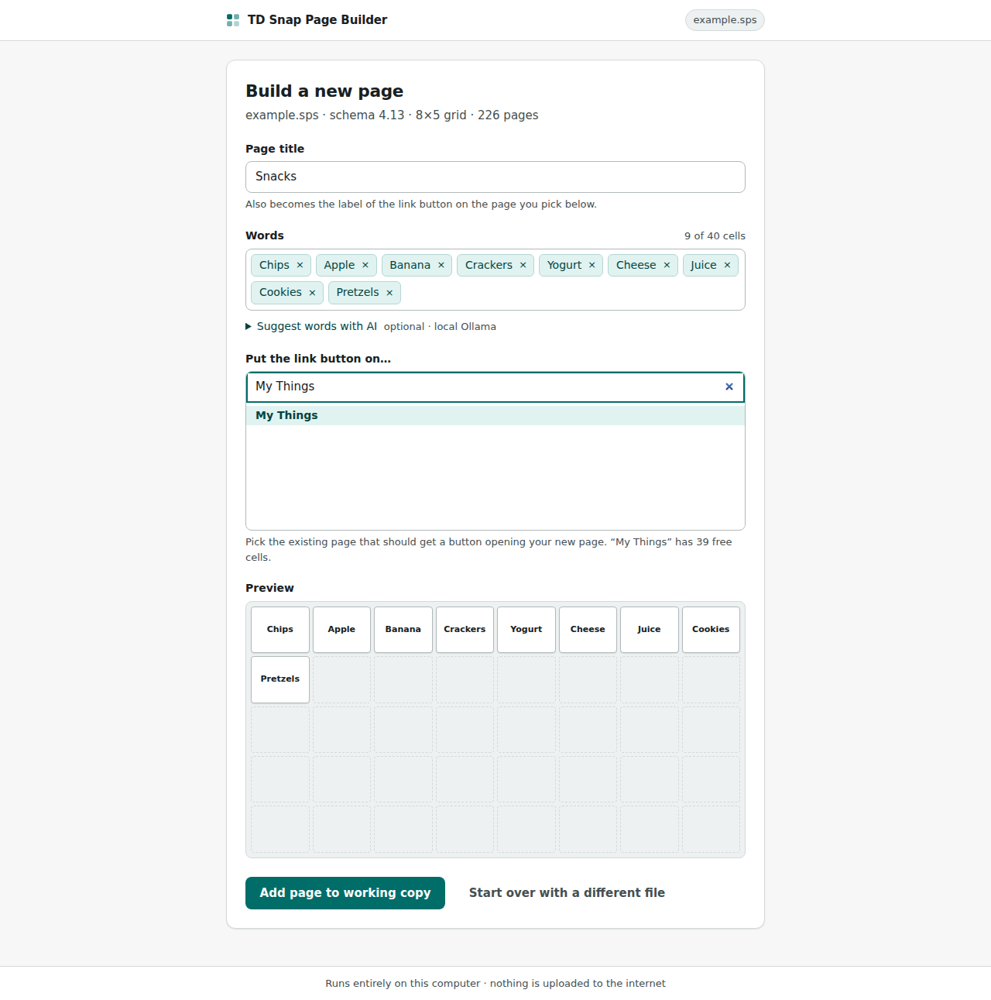

# AAC Editor

[](https://github.com/rjpenny16/AAC-Editor/actions/workflows/tests.yml)
[](https://github.com/rjpenny16/AAC-Editor/releases/latest)
[](LICENSE)

AAC Editor helps AAC users, parents, SLPs, and other professionals
spend less time editing buttons and more time communicating. Add many words or
entire topic pages at once, review every change before it runs, and update the
page or grid already open in TD Snap or Grid 3 so it keeps its existing sharing and sync
identity—saving hours of repetitive work.



## Download

Download **`AACEditor-*-windows-x64-setup.exe`** from the
[latest release](https://github.com/rjpenny16/AAC-Editor/releases/latest) and run
the installer. Python is not required. The installer places AAC Editor beneath
Program Files and its shortcuts launch that installed executable.

The production release workflow requires Authenticode signing through
SignPath. Do not continue if Windows identifies the publisher as unknown. Each
release also includes a SHA-256 checksum and verifiable build attestation from
the public workflow.

UIAccess is available only when the installed executable has a trusted
Authenticode signature and remains in its secure Program Files location. A
portable ZIP does not provide UIAccess; portable/development use may still need
the explicit administrator fallback for Grid 3.

## What it does

- Adds words to exact empty spaces on an existing TD Snap page — live, or in an
  exported copy.
- Fixes a typo or retires a word: changes what an existing TD Snap button says,
  moves it to another cell, or removes it, with the same review, verification,
  and rollback an addition gets. Buttons that open a page or run an action stay
  locked and say why.
- Undoes the last change it made, once, through the same review step — while the
  page is still as AAC Editor left it.
- Adds vocabulary to empty spaces AAC Editor can update safely on the grid open in Grid 3, preserving
  the grid-set file and each blank cell's existing style.
- Creates word or color-coded topic pages and links them from an existing page.
- Rejects duplicates, checks capacity, and never touches a button the review
  step did not name.
- Adds matching TD Snap symbols when TD Snap can find them, searching the words
  you choose — or none at all, per button.
- Suggests AAC-friendly placement and optional words or phrases with local AI.
- Verifies the completed edit and reports anything that still needs review.

If something goes wrong, **Copy a support report** in the footer collects the
versions and capability flags a bug report needs. It never includes page names,
button labels, or file names, so it is safe to paste in full.

## Private by design

The app listens only on your computer. Direct mode edits TD Snap through its
own Windows controls, so the active page set keeps its existing sharing and
sync identity. AAC Editor does not upload page-set files or button vocabulary;
the optional single-topic grounding request is the only exception described
below.

AI is optional and local:

- The packaged app can download Qwen2.5 1.5B Instruct once (~1 GB, Apache-2.0)
  and run it offline.
- If [Ollama](https://ollama.com/download) is already running, the app can use
  one of its installed models instead.

Online grounding is separate and off by default. If you explicitly enable it
for a suggestion, AAC Editor sends only that page title or category to
Wikipedia; button labels, page sets, and generated suggestions remain local.
Administrators can hard-disable grounding with `TDSNAP_WEB_GROUNDING=0`.

Nothing is written to disk until you save something. Remembering your last
AAC app, your Ollama connection, and an unfinished page (so a crash or a
reload can offer to resume it) all live in one `settings.json` in the same
per-user data folder the built-in AI model uses — never uploaded, never
synced. **What AAC Editor saves**, in the app's footer, lists exactly what's
stored in plain language, and **Clear all saved data** deletes the file.

## Quick start

1. Open TD Snap and the page set you want to edit.
2. Open AAC Editor and select **Use the page open in TD Snap**.
3. Add buttons, review their positions, and confirm the result-specific action.
4. Use **Choose another page** or **Create a new page** only when needed.
5. Review the checks before returning to TD Snap.

To fix, move, or retire something already on the page, select **Change, move, or
remove existing buttons**, then select the button itself — or drag it to another
cell, or move it with the arrow keys. Dropping one button on another has the two
trade places. AAC Editor changes only buttons whose whole job is to speak their
own message; a button that opens a page or runs an action stays locked and says
so on hover and on focus. Before a change, a move, or a removal runs, AAC Editor
reads what every affected button holds today, and refuses the edit outright if it
cannot — a destructive edit it could not undo is one it does not start. If the
edit then fails part-way, TD Snap is undone until each of those buttons holds its
prior label and spoken message again, and the result screen confirms that nothing
else on the page moved.

If an edit lands and turns out to be wrong, **Undo my last change** puts the page
back. It goes through the same review step, naming every button it will restore,
remove, or move home before anything runs. Three things it deliberately cannot
do, all of which it says on that screen: it reaches back one change only, it only
covers a change made while the app has been open, and it cannot reach back past a
sync in TD Snap or a change made in TD Snap itself. A button it re-creates is a
new button, so its symbol comes from a fresh TD Snap search.

Each button's symbol can be steered from the button editor: turn **Let TD Snap
add a symbol** off for one that should stay text-only, or set **Symbol search
words** when the label is a poor query — searching `more` for a button that says
*more please*. The result names the buttons that ended up without a symbol, so
there is no guessing about which ones to look at in TD Snap.

For Grid 3, choose **Grid 3** on the first screen, open the exact existing grid
you want to update, add vocabulary, review its order, and confirm the change.
Grid 3 support is capability-based across grid-set
families: AAC Editor reads the active grid's real geometry and only enables
unprotected `.gridset` format-1 grids with accessible, single-cell blanks. It
does not support `.gridsetx`/WordPower, Remote Editing, creating or linking
grids, changing occupied cells, or word-list population.

The Grid 3 connection runs a reversible Edit Mode compatibility check: it adds
a provisional Write command and label to a safe blank, undoes it, and verifies
that nothing was saved. If Grid 3 does not expose reliable accessible cell
bounds or editor controls, the feature stops without coordinate guessing, OCR,
computer vision, or direct grid-set mutation. The installed executable requests
`asInvoker` with
[`uiAccess`](https://learn.microsoft.com/en-us/windows/win32/winauto/uiauto-securityoverview).
Production UIAccess requires a trusted Authenticode signature and the secure
installer location; the application itself does not request administrator
elevation.

Keep Windows unlocked while an edit runs. The live editor is Windows-only and
depends on the current TD Snap interface. The exported-file fallback is
validated against a genuine TD Snap 4.13 export; see
[Importing edited page sets safely](docs/IMPORT_SAFETY.md) before using it.

## Python and command-line use

Requires Python 3.9 or newer:

```bash
pip install .
python -m tdsnap.web
```

Add `.[ai]` to install the built-in AI engine. The launchers are also available:

- Windows: double-click `launch.bat`
- macOS/Linux: run `./launch.sh` for exported-file and command-line work

Common commands:

```bash
python -m tdsnap list "My Page Set.sps"
python -m tdsnap verify "My Page Set.edited.sps"
python -m tdsnap inspect "My Page Set.sps"
python -m tdsnap.live status
python -m tdsnap.live add --yes --title Snacks --item Chips --item Apple
```

Exported-file edits always write a separate `*.edited.sps` copy. They discover
the file's schema at runtime, clone TD Snap's own records as templates, and run
SQLite integrity, foreign-key, linkage, and unexpected-change checks before
saving. TD Snap's proprietary `SyncHash` cannot be reproduced, so direct mode
is preferred when page-set sync matters. Exported files can add buttons to a page
that already exists as well as create one; existing buttons are shown but locked,
because changing and removing them there would need their own prior-content
snapshot and rollback.

## Development

```bash
pip install ".[dev]"
python -m pytest
ruff check tdsnap tests packaging scripts
coverage run -m pytest && coverage report
npm ci
npx playwright install chromium
npm run test:e2e
```

Install `.[ai,desktop]` and PyInstaller, then build the unsigned installer with
`./packaging/build.ps1 -Version 2.2.0`.
Unsigned output is suitable for packaging validation, not a production
UIAccess claim. See [development-only UIAccess signing](docs/UIACCESS_TESTING.md)
for an explicit temporary-certificate procedure.

The browser suite mocks TD Snap and Grid 3 accessibility responses. Real TD Snap
and Grid 3 tests are explicit opt-ins (`TDSNAP_LIVE_E2E=1` and
`GRID3_LIVE_E2E=1`) and must use disposable content. A real proprietary page or
grid set must never be committed; `scripts/fetch_fixture.py` downloads the
optional TD Snap integration fixture when needed.

Bug reports and pull requests are welcome. Read [CONTRIBUTING.md](CONTRIBUTING.md)
and the [security policy](SECURITY.md) first.

## Code signing policy

Free code signing provided by [SignPath.io](https://signpath.io/), certificate
by [SignPath Foundation](https://signpath.org/).

- Committer and reviewer: [Ryan Penny](https://github.com/rjpenny16)
- Signing approver: [Ryan Penny](https://github.com/rjpenny16)
- Releases are built from an existing version-matched tag, and the workflow
  refuses to publish unless SignPath signs both the application and installer.
- Privacy: AAC Editor will not transfer information to other networked systems
  unless specifically requested by the user or the person installing or
  operating it. The optional Wikipedia grounding control names the single
  topic value it sends before the request is made.

## License and trademarks

[MIT](LICENSE). The optional AI model is downloaded separately under its own
Apache-2.0 license. “TD Snap” is a trademark of Tobii Dynavox. This independent
community project is not affiliated with or endorsed by Tobii Dynavox or
Smartbox Assistive Technology. “Grid 3” is a Smartbox trademark.

---

Built by **Ryan Penny, M.A., CCC-SLP**, owner of
[myVoice Speech Therapy](https://www.myvoicespeechtherapy.com/).
