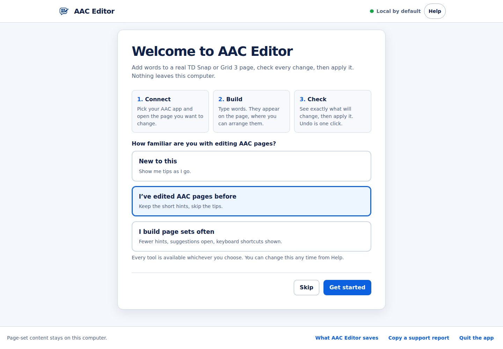

# AAC Editor

[](https://github.com/rjpenny16/AAC-Editor/actions/workflows/tests.yml)
[](https://github.com/rjpenny16/AAC-Editor/releases/latest)
[](LICENSE)

AAC Editor helps AAC users, parents, SLPs, and other professionals
spend less time editing buttons and more time communicating. Add many words or
entire topic pages at once, review every change before it runs, and update the
page or grid already open in TD Snap or Grid 3 so it keeps its existing sharing and sync
identity—saving hours of repetitive work.

**Private by design.** Your page sets, button labels, and the words you type never
leave your computer. There are no accounts, no analytics, and no tracking. Read
[exactly what AAC Editor keeps and what it can send](PRIVACY.md), and how to check
it yourself.



## Download

Download **`AACEditor-*-windows-x64-setup.exe`** from the
[latest release](https://github.com/rjpenny16/AAC-Editor/releases/latest) and run
the installer. Python is not required. The installer places AAC Editor beneath
Program Files and its shortcuts launch that installed executable.

Releases are not code-signed — no free Authenticode certificate is available
to this project — so Windows SmartScreen shows **Windows protected your PC** on
first run and names the publisher as unknown. Before choosing *More info → Run
anyway*, confirm the download is the one the public workflow built: compare
`Get-FileHash` against the `.sha256` file attached to the release, or run
`gh attestation verify <installer> --repo rjpenny16/AAC-Editor`. A file that
fails either check must not be run.

Live Grid 3 editing needs Windows administrator approval, each time you
connect. That is a consequence of the release being unsigned: an executable can
only reach Grid 3 without elevating if it carries a trusted Authenticode
signature, so AAC Editor asks for approval and reopens itself elevated instead.
If you are not an administrator on the computer, someone who is has to approve
it. TD Snap editing and exported files never need any of this, and the app says
so on the Grid 3 screen rather than leaving you to work it out.

## What it does

- Adds words to exact empty spaces on an existing TD Snap page — live, or in an
  exported copy.
- Fixes a typo or retires a word: changes what an existing TD Snap button says,
  moves it to another cell, or removes it, with the same review, verification,
  and rollback an addition gets. Buttons that open a page or run an action stay
  locked and say why.
- Undoes the last change it made, once, through the same review step — while the
  page is still as AAC Editor left it.
- Does the same on the grid open in Grid 3: adds speaking cells to safe empty
  spaces, changes, moves, or removes existing speaking cells, undoes the last
  change, and creates a new grid linked from the open one — every step
  performed by Grid 3's own Edit Mode and checked against the saved grid-set
  file afterwards. Cells that jump to another grid, run a command, or span
  more than one square stay locked and say why.
- Creates word or color-coded topic pages and links them from an existing page.
- Imports a word list: paste a spreadsheet column or open a CSV/TSV, map which
  column is the label, the message, the function, and the symbol words, and see
  everything that will not fit named before anything is added.
- Saves a page you have built as a named template and reuses it for the next
  person — one topic page built once, used across a caseload.
- Reads and writes **Open Board Format** (`.obf`/`.obz`), the AAC interchange
  standard CoughDrop and several other tools use. One board's words can join the
  page open in TD Snap, Grid 3, or an exported file; on an exported file a whole
  board set becomes new pages linked the way the boards were, through the same
  review. A page set exports to `.obz` with its labels, spoken messages, layout,
  and links. See [Open Board Format](#open-board-format) for what does not come
  across.
- Queues several pages, reviews them as one list, and applies them in one go,
  reporting what happened to every page including any it did not attempt.
- Rejects duplicates, checks capacity, and never touches a button the review
  step did not name. A word that already exists elsewhere in the page set is
  pointed out but never blocked.
- Adds matching TD Snap symbols when TD Snap can find them, searching the words
  you choose — or none at all, per button.
- Suggests AAC-friendly placement and optional words or phrases with local AI.
  Suggestions arrive as candidates you keep or discard, so nothing a model
  produced reaches the page unasked, and every one you keep is still steerable:
  swap it for another, ask for more like it, or throw it away and it is not
  offered again.
- Verifies the completed edit and reports anything that still needs review.

If something goes wrong, **Copy a support report** in the footer collects the
versions and capability flags a bug report needs. It never includes page names,
button labels, or file names, so it is safe to paste in full.

## Private by design

The app listens only on your computer. Direct mode edits TD Snap through its
own Windows controls, so the active page set keeps its existing sharing and
sync identity. AAC Editor does not upload page-set files or button vocabulary. It
has no accounts, no analytics, no crash reporting, and no update checks. It uses
the internet in only two situations, and you start both: the one-time download of
the optional suggestion model (from huggingface.co), and the optional Wikipedia
lookup described below. [PRIVACY.md](PRIVACY.md) is the full statement, and
[docs/SECURITY_AUDIT.md](docs/SECURITY_AUDIT.md) is the technical review behind it.

AI is optional and local. It is one button to start: the **Stuck for ideas?**
panel on the vocabulary screen says whether suggestions are **Ready** or need a
one-time **Setup**, and setting them up downloads the model once while you carry
on adding words.

- The packaged app can download Qwen2.5 1.5B Instruct once (~1 GB, Apache-2.0)
  and run it offline. Every built-in model is pinned to an exact URL, byte size
  and SHA-256, and a download that does not match all three is thrown away.
  Where the app offers more than one, the larger ones are unlocked by the
  memory this computer is *measured* to have — a machine whose memory cannot be
  read is offered the small model and nothing bigger.
  First-time setup recommends **Qwen3 4B Instruct 2507** (~2.5 GB) on a
  measured 12 GB-class computer. It performed best in our local vocabulary
  comparison. Existing installations can download and select it under
  **Suggestion settings → Built-in suggestion model**. The small model and
  Qwen2.5 7B (~4.7 GB, 16 GB-class computers) remain available. Both prompt
  processing and generation use at most six CPU threads to leave headroom.
- If [Ollama](https://ollama.com/download) is already running, the app can use
  one of its installed models instead — picked from a list of what you actually
  have, not typed from memory. **Suggestion settings** chooses which engine
  runs; a choice that cannot run is stood in for, and the panel says which model
  wrote the suggestions.
- Suggestions can be asked to match how your page set already writes a button.
  That sample of your own labels goes to the model on this computer and no
  further; turn it off with **Match the wording style of this page set**.

Online grounding is separate and off by default, and it starts off again every
time you open the app: it is never remembered. If you explicitly enable it for a
suggestion, AAC Editor sends only that page title or category to
Wikipedia; button labels, page sets, style samples, rejected suggestions, and
generated suggestions all remain local. The article it used is named under the
suggestions with a link, and you can send it to a different one — or to none —
if it picked the wrong "Mercury". Administrators can hard-disable grounding
with `TDSNAP_WEB_GROUNDING=0`.

**Use a specific reference page** accepts an exact English Wikipedia article
link or title. It reads that article directly, including lists and tables,
and selects relevant sections throughout the page. For any other website,
paste its relevant text into the reference field; pasted text stays local
and takes priority over web lookup. A failed exact article lookup asks you to
check the link or paste text rather than silently choosing another source.
Word suggestions using a reference must appear in the selected source text;
this checks evidence, while relevance to the requested type still depends on
the model. Online lookup remains optional; requests without a reference use
the model's own knowledge.

The app supplies instructions automatically on every request: match the exact
topic and requested type, prefer useful short labels, respect rejected and
existing buttons, and return fewer items rather than pad a list. Source-based
word requests use a separate standing instruction and structured request data.
Phrase requests have their own rules; a requested phrase function is also
restricted in the output schema. You only need to describe the intended topic
or narrower group, for example “Only Death Eaters, full names.” Instructions
help with selection and formatting; accurate reference text is still much
more reliable than model memory for unfamiliar names. See
[AI quality notes](docs/AI_QUALITY.md) and the
[model comparison](docs/ai-model-comparison/README.md).

AAC Editor keeps very little on disk, and shows you what it keeps. Remembering
your last AAC app, your answer to the welcome question, your AI choices, and any
templates you save all live in one `settings.json` in the per-user data folder the
built-in AI model also uses, never uploaded and never synced. An unfinished page
(so a crash or a reload can offer to resume it) is kept there only if you turn on
**Keep an unfinished page**, and it is off until you do. While you edit an exported
file, a working copy sits in your temporary folder, readable only by your account,
and is deleted when you close the file or quit. **What AAC Editor saves**, in the
app's footer, lists what is stored right now in plain language, with the real
folder names. **Clear all saved data** removes the settings file, templates, any
unfinished page, and any leftover working copies.

## Quick start

The first time it opens, AAC Editor asks one question: how familiar you are with
editing AAC pages. The answer only changes how much guidance you see (tips for
somebody new, fewer hints for somebody who builds page sets often). Every tool is
there whichever you pick, and **Help** in the header changes it at any time. The
answer is kept in the same local settings file as everything else, listed in
**What AAC Editor saves**, and cleared with it.

After that, every edit is three steps:

1. **Connect.** Open TD Snap to the page you want to change, then select
   **Connect to TD Snap** (or pick Grid 3, or an exported file).
2. **Build.** The page is on screen next to the word box. Type a word and select
   **Add**; it appears in its space on the page, where you can drag it or move it
   with the arrow keys. **Page layout** switches between standard buttons and
   color-coded topic-page rows. **Import a word list**, **Templates**, and
   **Suggest words with AI** sit on the same screen. Use **Choose another page**
   or **Create a new page** above the grid only when needed.
3. **Check.** Select **Check changes** to see exactly what will be added,
   changed, moved, or removed, then confirm with the button that names the
   change. Nothing touches your AAC app
   before that. **Back to the page** returns to the grid to adjust anything.

To fix, move, or retire something already on the page, select the button on the
Build screen's grid, or drag it to another cell, or move it with the arrow keys.
Dropping one button on another has the two
trade places. AAC Editor changes only buttons whose whole job is to speak their
own message; a button that opens a page or runs an action stays locked and says
so on hover and on focus. Before a change, a move, or a removal runs, AAC Editor
reads what every affected button holds today, and refuses the edit outright if it
cannot — a destructive edit it could not undo is one it does not start. If the
edit then fails part-way, TD Snap is undone until each of those buttons holds its
prior label and spoken message again, and the result screen confirms that nothing
else on the page moved.

If an edit lands and turns out to be wrong, **Undo my last change** puts the page
back. It goes through the same review step, naming every button it will restore,
remove, or move home before anything runs. Three things it deliberately cannot
do, all of which it says on that screen: it reaches back one change only, it only
covers a change made while the app has been open, and it cannot reach back past a
sync in TD Snap or a change made in TD Snap itself. A button it re-creates is a
new button, so its symbol comes from a fresh TD Snap search.

Each button's symbol can be steered from the button editor: turn **Let TD Snap
add a symbol** off for one that should stay text-only, or set **Symbol search
words** when the label is a poor query — searching `more` for a button that says
*more please*. The result names the buttons that ended up without a symbol, so
there is no guessing about which ones to look at in TD Snap.

For Grid 3, choose **Grid 3** on the first screen and open the grid you want
to work on. The same two tasks TD Snap offers are then available: add to the
open grid — including changing, moving, or removing the speaking cells already
on it — or create a new grid, which Grid 3 links from the first empty cell of
the open grid. A new grid is always the open grid's size and carries Grid 3's
own **Back** cell in its top-left square; Grid 3's row and column pickers are
left alone because their result depends on how they are driven rather than on
the value chosen. Grid 3 is left showing whichever grid the edit ended on.
Choosing Grid 3 lists what it can and cannot do before you commit, and every
gate it stops at names itself: Grid 3 not installed, a grid not open, an
unfinished change to save first, a locked desktop, or administrator approval.

Grid 3 support is capability-based: AAC Editor reads the grid-set file for the
grid's real content and finds every cell by the ids Grid 3 exposes through UI
Automation, in the viewer and in Edit Mode. Only unprotected `.gridset`
format-1 grids are supported. Anything the accessible surface does not offer is
refused with a message naming what was missing. Not supported: Remote Editing,
word-list population, and cells that are not plain speaking (Write) cells.

**`.gridsetx` grid sets, including WordPower, are not supported, and cannot
be.** Every file inside a `.gridsetx` — the settings, every grid, every
picture — is encrypted by Grid 3. AAC Editor's safety model depends on reading
the grid before an edit and checking the saved file afterwards, neither of
which is possible without the key, and the project will not work around a
licence protection. This is a definite position, not an unbuilt feature: edit
those grid sets in Grid 3 itself.

The Grid 3 connection runs a reversible Edit Mode compatibility check: it adds
a provisional Write command and label to a safe blank, undoes it, and verifies
that nothing was saved. Every edit then happens in one Edit Mode session and one
save; if the saved file does not match what was reviewed, AAC Editor undoes and
re-saves until it does, and the message names the exact cell that differed.
Because every step is typed into Grid 3, AAC Editor refuses to type at all if
another window takes the keyboard mid-edit, rather than send a keystroke into
whatever is in front. Keep the keyboard and mouse alone while an edit runs.

Grid 3 runs with `uiAccess`, which puts its windows at a higher integrity level
than an ordinary app, so reading its accessibility tree needs administrator
rights. Connecting to Grid 3 asks for that approval through a normal UAC prompt
and restarts the app elevated; cancelling leaves the running copy untouched.

Keep Windows unlocked while an edit runs. The live editor is Windows-only and
depends on the current TD Snap interface. The exported-file fallback is
validated against a genuine TD Snap 4.13 export; see
[Importing edited page sets safely](docs/IMPORT_SAFETY.md) before using it.

## Python and command-line use

Requires Python 3.9 or newer:

```bash
pip install .
python -m tdsnap.web
```

Add `.[ai]` to install the built-in AI engine. The launchers are also available:

- Windows: double-click `launch.bat`
- macOS/Linux: run `./launch.sh` for exported-file and command-line work

Common commands:

```bash
python -m tdsnap list "My Page Set.sps"
python -m tdsnap verify "My Page Set.edited.sps"
python -m tdsnap inspect "My Page Set.sps"
python -m tdsnap export-obz "My Page Set.sps" -o "My Page Set.obz"
python -m tdsnap import-obz "My Page Set.sps" "Quick Core.obz" --parent-name "Home Page"
python -m tdsnap.live status
python -m tdsnap.live add --yes --title Snacks --item Chips --item Apple
```

Exported-file edits always write a separate `*.edited.sps` copy. They discover
the file's schema at runtime, clone TD Snap's own records as templates, and run
SQLite integrity, foreign-key, linkage, and unexpected-change checks before
saving. TD Snap's proprietary `SyncHash` cannot be reproduced, so direct mode
is preferred when page-set sync matters. Exported files can add buttons to a page
that already exists as well as create one; existing buttons are shown but locked,
because changing and removing them there would need their own prior-content
snapshot and rollback.

## Open Board Format

[Open Board Format](https://www.openboardformat.org) is how AAC apps share
vocabulary: an `.obf` is one board, an `.obz` is a set of boards with links
between them. **Open Board files** on the Build screen does both directions.

**Bringing boards in.** One board's speaking buttons can join the word list for
the page you have open, on any connection, in the board's own cells when the
page is big enough. On an exported file, every board in an `.obz` can become its
own new page instead: buttons in their board's row and column (or in reading
order when a board is bigger than the page set's grid), buttons that opened
another board now opening that page, and the first board linked from the page
you chose. The review screen names every page and everything left out before
anything is written, and the import is one validated transaction — if any page,
button, or link fails a check, none of it is saved.

**Taking a page set out.** An exported file, or the page set TD Snap has open
(read only, never changed), saves as `.obz`. The export carries each page's
labels, what each button says, where it sits, and which of the page set's own
pages it opens. **Symbols are not exported.** TD Snap's symbols are licensed
content, so the `.obz` has no images at all; the app that opens it will show
words without pictures until symbols are added there.

What does not come across, in either direction, is named rather than dropped
silently:

- pictures in an imported board (TD Snap looks up its own symbols for words
  added while it is open; an exported file gets no symbols);
- buttons that run an action rather than speaking or opening a board — OBF's
  `:clear`, `:home`, spelling, and TD Snap's own commands;
- links to pages outside the file, such as TD Snap's shipped Back and Home
  buttons, and web links;
- border colours other than the five topic-page function colours, which are the
  only ones AAC Editor writes;
- hidden buttons, picture-only buttons, labels over 60 characters, messages
  over 200, and a second button with the same label on one board.

Adding a whole set as linked pages is for exported files only. Doing it live
would mean creating and linking many pages through TD Snap's editing screens one
at a time; the file path does it in one transaction the app can check completely.
Grid 3 can take one board's words, and does not export.

## Development

```bash
pip install ".[dev]"
python -m pytest
ruff check tdsnap tests packaging scripts
coverage run -m pytest && coverage report
npm ci
npx playwright install chromium
npm run test:e2e
```

Install `.[ai,desktop]` and PyInstaller, then build the installer with
`./packaging/build.ps1 -Version 2.3.0`. Release builds are unsigned; `-Sign`
with `AAC_EDITOR_SIGNING_THUMBPRINT` set signs with a certificate you supply.

What a model returns is cleaned before it is ever offered: numbering, bullets,
quotation marks, markdown and trailing explanations are stripped, and the page
title restated, an item that is really a sentence, a repeat, anything already on
the page, and anything you rejected are dropped (`tdsnap/web/prompts.py`, pinned
by `tests/test_ai_cleaning.py`). Because that drops items, the request asks for
more than you wanted and a round that comes back nearly empty is asked once
more.

The privacy promises have their own tests. `tests/test_privacy_contract.py` uses
real sockets and scans the source to pin that local traffic never uses a proxy,
that only a short, named list of modules can reach the network, that the page can
load nothing from anywhere else, and that what the documents say matches what the
code does. Adding a new way for data to leave the computer fails it on purpose.

AI suggestion quality also has its own harness. `tests/fixtures/ai_eval_set.json`
holds a fixed set of category prompts and the rules the prompt already states —
*"Harry Potter characters"* must not return *"wand"*, and must return somebody
from the books. The scoring runs offline on every CI build
(`tests/test_ai_eval_rules.py`); the same rules run against the real model, and
record a pass rate, when opted in. The recorded rate is a trend to compare
release to release rather than a bar to clear — CI runs a model a third the
size of the one that ships — so it does not fail a build unless
`TDSNAP_AI_EVAL_FLOOR` is set:

```bash
TDSNAP_AI_SMOKE=1 python -m pytest tests/test_ai_eval.py
python scripts/verify_model_pins.py   # confirm each model pin with its publisher
```

For a release quality check against the actual offered models, run
`python scripts/evaluate_ai_quality.py --model large --download --report ai-quality.json`.
This runs the fixed eval cases through generation and filtering and fails below
100% by default (`--floor` can set a different threshold). Use repeated `--case`
options to select a focused set. The reference cases require every output to
belong to the requested set, including a restricted character subgroup and a
source that has fewer names than requested; one recognizable name cannot hide
an otherwise inaccurate answer. The existing cheap CI smoke model remains a
plumbing check, rather than evidence of the shipped model's vocabulary quality.

The browser suite mocks TD Snap and Grid 3 accessibility responses. Real TD Snap
and Grid 3 tests are explicit opt-ins (`TDSNAP_LIVE_E2E=1` and
`GRID3_LIVE_E2E=1`) and must use disposable content. A real proprietary page or
grid set must never be committed; `scripts/fetch_fixture.py` downloads the
optional TD Snap integration fixture when needed.

Bug reports and pull requests are welcome. Read [CONTRIBUTING.md](CONTRIBUTING.md)
and the [security policy](SECURITY.md) first.

## Release integrity

Releases are not code-signed. Free code signing for open source was applied for
and declined, and a paid certificate is not in this project's budget. Two things
follow from that, and only these two: SmartScreen warns on first run, and live
Grid 3 editing has to ask for administrator approval instead of reaching Grid 3
directly. Everything else in AAC Editor is unaffected. If a certificate ever
becomes available, `./packaging/build.ps1 -Sign` is the whole change: the signed
build embeds the `uiAccess` manifest, and the administrator prompt goes away.

- Committer and reviewer: [Ryan Penny](https://github.com/rjpenny16)
- Releases are built from an existing version-matched tag by the public
  workflow, which installs and health-checks the package before attaching it.
- Every installer ships with a SHA-256 checksum and a
  [build provenance attestation](https://docs.github.com/en/actions/security-for-github-actions/using-artifact-attestations)
  tying it to the exact commit and workflow run that produced it.
- Privacy: AAC Editor will not transfer information to other networked systems
  unless specifically requested by the user or the person installing or
  operating it. The optional model download and the optional Wikipedia lookup are
  the only two, and each says what it sends before it runs. See
  [PRIVACY.md](PRIVACY.md).

## License and trademarks

[MIT](LICENSE). The optional AI model is downloaded separately under its own
Apache-2.0 license. “TD Snap” is a trademark of Tobii Dynavox. This independent
community project is not affiliated with or endorsed by Tobii Dynavox or
Smartbox Assistive Technology. “Grid 3” is a Smartbox trademark.

---

Built by **Ryan Penny, M.A., CCC-SLP**, owner of
[myVoice Speech Therapy](https://www.myvoicespeechtherapy.com/).
